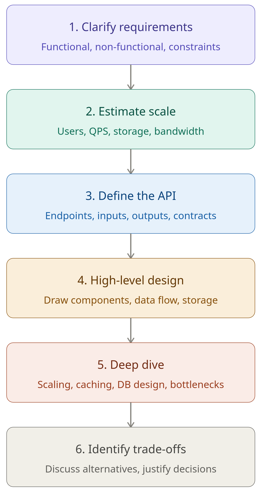

# System-Design Guide
> Created by: @vedbulsara04
---

## *Introduction*

### ` What is System Design ? `

System design is the process of planning and structuring the architecture of a software system based on user requirements. 
It defines how different components will work together to achieve the desired function efficiently.

### ` How to approach System Design `

---

1. **Clarify Requirements**: Never jump straight into designing. Ask questions first.
   - What are the core features? (functional requirements)
   - How many users? What's the expected load? (non-functional requirements)
   - Any constraints? (budget, existing tech stack, latency SLAs?)

2. **Estimate Scale**: Quick estimates for system sizing.
   - How many requests per second (QPS)?
   - How much data stored per day/year?
   - Read-heavy or Write-heavy data?
   
   > This guides whether you need Caching, Sharding, CDN, etc.

3. **Define the API**: Before drawing boxes, define what the system does.
   - What endpoints exist? (POST /tweet, GET /feed)
   - What goes in and out of each endpoint?
   
   > This keeps the design grounded in real user actions. 

4. **High-Level Design**: 
   - Draw the big picture (clients, servers, DBs, queues, CDNs).
   - Don't over-engineer yet; focus on getting the data flowing end-to-end.

5. **Deep Dive**: Pick the hardest or most interesting components and go deeper.
   - How does the database schema look?
   - Where do you add a cache?
   - How do you handles hot spots or failures?

6. **Identify Trade-Offs**: No design is perfect. Acknowledge the trade-offs you made:
   - Why SQL over NoSQL (or vice versa)?
   - What would break at 10x scale?
   - What did you leave out and why?

---

## *Performance v/s Scalability*

### ` Performance in System-Design `
Performance is about how fast, efficiently, and reliably a system responds under load. 
It's one of the most critical non-functional requirements in any system design.

**Core Performance Metrics**:
1. *Latency*: Time taken to process a single request.
2. *Throughput*: Number of requests a system can handle per unit of time (QPS).
3. *Availability*: Percentage of time a system is operational.
   
   > 99.9% availability = ~8.7 hrs downtime/year
4. *Error Rate*: Percentage of requests that fail out of all requests made to a system.

### ` Scalability in System-Design `

Scalability is the system's ability to handle increased load, without sacrificing system performance.

**Types of Scalability**:
1. *Vertical Scaling (Scale-Up)*: Add more power to the same machine.
   
   > more CPU, RAM, Storage
   
   > Simple but has a hardware limit and single point of failure
2. *Horizontal Scaling (Scale-Out)*: Add more machines to distribute the load.
   
   > More complex but virtually unlimited and fault tolerant

---

## *Latency v/s Throughput*

### ` Latency in System-Design `

Latency is the time it takes to complete a single operation, from request to response.

**Types of Latency**:
1. *Network Latency*: Time for data to travel across the network.
2. *Disk I/O Latency*: Time to read/write from storage.
3. *Processing Latency*: Time the CPU spends computing.
4. *End-to-end Latency*: Total perceived delay by the user.

**How to reduce Latency**:
- ***Caching***: serve data from memory(Redis,CDN) instead of disk or remote services.
- ***Connection Pooling***: avoid TCP handshake overhead on every request.
- ***Geographically distributed nodes***: bring data closer to users.
- ***Async I/O or non-blocking operations***: don't wait idle; do other work.
- ***Reduce hops***: fewer services in the call chain means less accumulated delay.

### ` Throughput in System-Design `

Throughput is the number of operations a system can handle per unit of time, often measured in requests per second or QPS.

**How to increase throughput**:
- ***Horizontal Scaling***: add more machines to share the load.
- ***Load Balancing***: distribute requests evenly across instances.
- ***Batching***: process multiple operations together.
- ***Concurrency***: handle many requests in parallel (threads, async, event loops)
- ***Efficient data formats***: Protocol Buffers over JSON reduces serialization cost.

---

## *Availability & Consistency*

### ` Availability in System-Design `

Availability means every request receives a response, not necessarily the most up-to date, but the system stays operational and never returns an error due to node failure.

**How to achieve high availability**:

- ***Replication***: duplicate data across multiple nodes so no single node is a point of failure.
- ***Failover***: automatically switch to a standby node when the primary fails.
- ***Health checks & Load Balancers***: route traffic away from unhealthy or overloaded nodes.
- ***Redundancy at every layer***: servers, databases, network links, data centers.
- ***Graceful Degradation***: return partial or cached data rather than erroring out.

### ` Consistency in System-Design `

Consistency means every read reflects the most recent write; all nodes in the system see the same data at the same time.